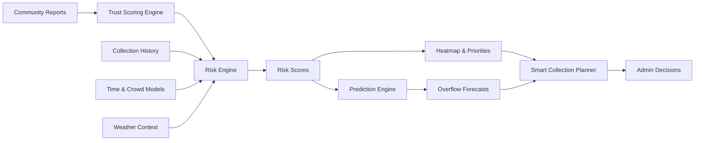
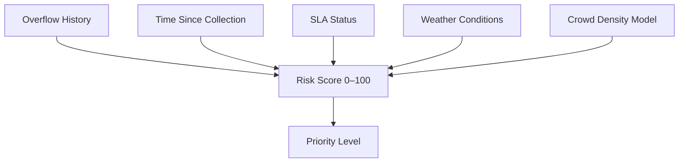
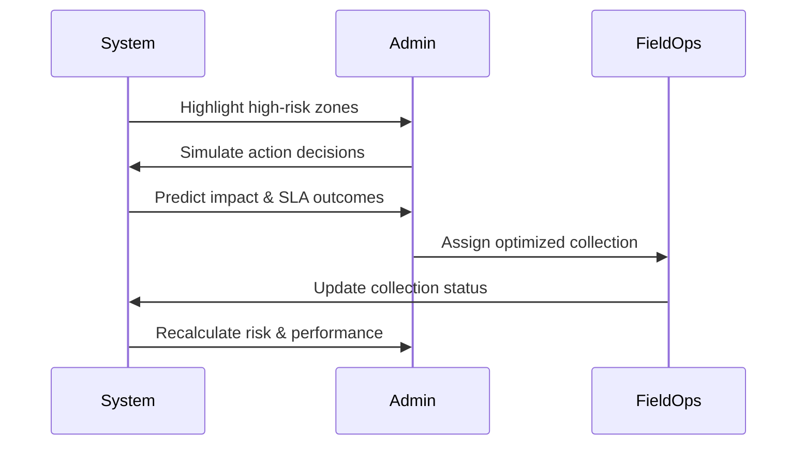

# WasteSense AI

<<<<<<< HEAD
A React + Firebase application for intelligent waste management with real-time risk assessment, SLA monitoring, and overflow prediction.

## Architecture

This project uses a **hybrid architecture**:
- **Frontend**: React application (client-side UI and data visualization)
- **Backend**: Firebase Cloud Functions (authoritative calculations and scheduled jobs)

### Backend Functions

The `functions/` directory contains serverless backend logic:

- **Risk Engine** (`engines/riskEngine.js`): Authoritative risk score calculation
  - Triggers on `bins` and `reports` collection writes
  - Calculates risk based on overflow history, time since collection, SLA status, weather, and crowd data
  
- **SLA Engine** (`engines/slaEngine.js`): SLA monitoring and breach detection
  - Scheduled job runs every 12 minutes
  - Monitors all bins for SLA compliance
  - Detects and tracks breaches
  
- **Prediction Engine** (`engines/predictionEngine.js`): Overflow prediction
  - Scheduled job runs every hour
  - Analyzes trends and predicts overflow likelihood

## Setup Instructions

### Prerequisites

- Node.js 18+ installed
- Firebase account
- Firebase CLI installed globally: `npm install -g firebase-tools`

### Initial Setup

1. **Login to Firebase**:
   ```powershell
   firebase login
   ```
   This will open a browser for authentication.

2. **Create a Firebase Project** (if you don't have one):
   - Go to https://console.firebase.google.com/
   - Click "Add project" or "Create a project"
   - Enter a project name (e.g., "wastesense-ai")
   - Follow the setup wizard
   - **Important**: Enable Firestore Database when prompted

3. **Set Your Firebase Project**:
   ```powershell
   firebase use --add
   ```
   Select your project from the list.

   Or if you know your project ID:
   ```powershell
   firebase use YOUR_PROJECT_ID
   ```

4. **Install Frontend Dependencies**:
   ```powershell
   npm install
   ```

5. **Install Functions Dependencies**:
   ```powershell
   cd functions
   npm install
   cd ..
   ```

### Deployment

**Deploy Cloud Functions**:
```powershell
cd functions
firebase deploy --only functions
```

Or use the helper script:
```powershell
.\deploy-functions.ps1 -ProjectId YOUR_PROJECT_ID
```

### Development

**Run Frontend**:
```powershell
npm run dev
```

**Test Functions Locally** (optional):
```powershell
cd functions
npm run serve
```

## Project Structure

```
TechSprint/
├── functions/              # Firebase Cloud Functions
│   ├── index.js           # Function triggers and schedules
│   ├── engines/           # Business logic engines
│   │   ├── riskEngine.js
│   │   ├── slaEngine.js
│   │   └── predictionEngine.js
│   ├── services/          # Service layer
│   │   └── firestore.js
│   └── package.json
├── src/                   # React frontend
│   ├── components/
│   ├── pages/
│   └── services/
├── firebase.json          # Firebase configuration
└── package.json
```

## How It Works

1. **Risk Calculation**: When a bin or report is created/updated, a Cloud Function automatically recalculates the risk score and writes it back to the bin document.

2. **SLA Monitoring**: Every 12 minutes, a scheduled function checks all bins for SLA compliance and updates their status.

3. **Overflow Prediction**: Every hour, a scheduled function analyzes trends and predicts which bins are likely to overflow.

4. **Frontend**: The React app reads the computed values (riskScore, slaStatus, overflowPrediction) from Firestore and displays them in real-time.

## Notes

- The backend is the **authoritative source** for risk scores, SLA status, and predictions
- Frontend calculations are for display purposes only
- All backend logic is centralized in the `functions/` directory
- No business logic in `index.js` - it only wires triggers and schedules
=======
### Predictive Cleanliness Intelligence for Smarter Cities & Campuses

---

## Overview

**WasteSense AI** is a predictive cleanliness intelligence platform that transforms how waste management systems operate.
Instead of reacting to overflows and complaints, WasteSense AI **anticipates risk, prioritizes action, and guides decisions** using real-time data, behavioral modeling, and explainable intelligence.

It is designed as a **decision-support system** for administrators — not just a monitoring dashboard.

---

## The Problem Space

Waste management systems traditionally suffer from:

* Reactive response after overflow occurs
* Uniform collection schedules regardless of need
* No accountability for delayed action
* No insight into *where the next problem will happen*
* No way to measure cleanliness performance over time

These systems manage *tasks*, but not *intelligence*.

---

## The WasteSense AI Approach

WasteSense AI treats cleanliness as a **dynamic, measurable, and predictable system**.

It combines:

* Historical behavior
* Environmental context
* Time-based human activity
* Service-level accountability

to continuously answer one question:

> **“Where should attention go next — and why?”**

---

## Core Capabilities

### 🧠 Predictive Risk Intelligence

Each waste location is assigned a **dynamic risk score (0–100)** that updates continuously based on:

* Overflow frequency
* Time since last collection
* Service-level status
* Environmental and crowd context

---

### 🗺️ Priority Heatmap Visualization

A live spatial heatmap highlights **cleanliness stress zones**, allowing instant identification of areas requiring attention.

---

### 🔮 Overflow Forecasting

Trend-based intelligence predicts which locations are likely to overflow in the **next 6–12 hours**, enabling preventive action.

---

### ⏱️ Service-Level Accountability (SLA)

Every report and collection cycle is tracked against defined response windows:

* On-time
* At-risk
* Breached

This introduces **measurable accountability** into cleanliness operations.

---

### 👥 Community Trust Modeling

Reports are weighted by **credibility scores**, ensuring:

* Reliable data influence decisions more
* Noise and misuse are naturally reduced

---

### 🚚 Smart Collection Planning

The system recommends:

* Which locations must be serviced immediately
* Which can be safely deferred
* How workload aligns with available workforce capacity

---

### 📊 Cleanliness Analytics

Decision-makers gain visibility into:

* High-risk zones over time
* SLA compliance trends
* Resolution efficiency
* Overall cleanliness improvement

---

## System Architecture

### High-Level Flow



---

## Risk Intelligence Model



---

## Decision-Support Loop



---

## Technology Stack

* **Frontend:** React (Vite)
* **Data Layer:** Firebase Firestore
* **Authentication:** Firebase Auth
* **Mapping & Visualization:** Google Maps JavaScript API
* **Logic Engines:** Modular intelligence services (risk, prediction, simulation)

The platform is entirely web-based, modular, and scalable.

---

## Configuration

To run the system:

```bash
npm install
npm run dev
```

Required setup:

* Add Firebase configuration in `src/services/firebase.js`
* Add Google Maps API key in `src/components/MapView.jsx`

---

## Design Principles

* **Predict before reacting**
* **Explain every decision**
* **Optimize effort, not just activity**
* **Measure service quality**
* **Scale from local to city-wide**

---

## Future Evolution

WasteSense AI is designed to evolve toward:

* Automated sensor integration
* City-scale deployment
* Policy simulation and planning
* Environmental impact tracking

---

## Closing Note

WasteSense AI is not a reporting tool.
It is not a task tracker.
It is not just a map.

It is a **cleanliness intelligence system** — built to help decision-makers act **earlier, smarter, and with confidence**.


Just tell me.
>>>>>>> 576ac3c196b9596a5a7b2fd7746fb3037fe3a3b8
